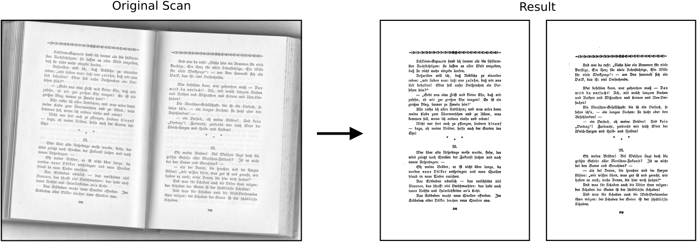
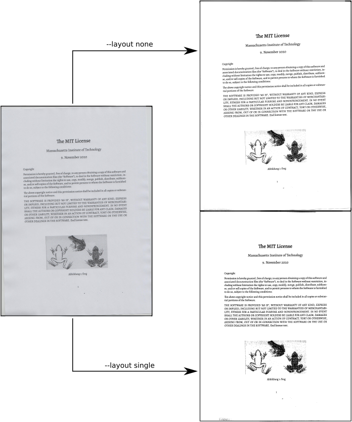

# pdfiron

<p align="center">
  
</p>

Pdfiron is basically a part-reimplementation of [pdfsandwich](http://www.tobias-elze.de/pdfsandwich/index.html). Thus it uses [unpaper](https://github.com/unpaper/unpaper) to optimize the documents and [ŧesseract](https://github.com/tesseract-ocr/tesseract) for OCR. The main motivation was to support the splitting of double layouts (two book pages per scanned page in the input file) into individual pages in the output document. It's also possible to skip Tesseract and produce optimized documents faster.


## Motivation and Example

Studying human sciences at university demands reading lots of text. Frustratingly these are often provided as nearly unreadable scans. Further on this documents contain almost always only an image of the scanned pages, thus it's not possible to copy any content out of this files. This tool combines a number of different applications to provide readable PDF's. By default pdfiron also applies Optical character recognition ([OCR](https://en.wikipedia.org/wiki/Optical_character_recognition)) to your document, providing you with copyable text within the resulting PDF.

For an example, take this scan from Friedrich Nietzsches [Also sprach Zarathustra](https://en.wikipedia.org/wiki/Also_sprach_Zarathustra):




## Installation

Pdfiron depends on a number of applications to perform it's task:

- ImageMagick's [`convert`](https://imagemagick.org/script/convert.php) application for converting PDF's into images.
- `pdfinfo` and `pdfunite` from the [Poppler](https://poppler.freedesktop.org/) project.
- [`unpaper`](https://github.com/unpaper/unpaper) to perform the document optimization.
- [`tesseract`](https://github.com/tesseract-ocr/tesseract) and it's language file for OCR.

Under Debian based system you can install the dependencies with the following packages:

```shell script
apt install imagemagick unpaper poppler tesseract-ocr tesseract-ocr-eng

# Do not forget to install additional language packages for tesseract if needed:
apt install tesseract-ocr-deu
``` 


## Usage

Please also use the built in help via `pdfiron --help`. The most basic call of pdfiron is as follows:

```shell script
pdfiron scan.pdf
```

This will take `scan.pdf` as an input and performs the optimization and OCR on the file. If not stated otherwise (via the `--output`, `-o` argument) the result will be saved as `scaned-ironed.pdf`. Please note that the process can take some time (even minutes). This heavily depends on the input document and your system. It's possible to tweak the performance by alter the resolution and/or number of Tesseract threads (see below).

If our document isn't in English, use the `--lang`, `-l` parameter to specify another language. To work properly the Tesseract language package has to be installed on your system.

```shell script
pdfiron scan.pdf --lang deu
```


### Splitting pages

It's fairly common to get scans which contain two book pages on one page. This can be quit annoying if you want to print the text as a brochure (side node: `pdfbook` from the [pdfjam package](https://github.com/DavidFirth/pdfjam) is quit good at this). To do this use the following command:

```shell script
pdfiron scan.pdf --layout double --output-pages 2
```

The `--layout double` informs Unpaper to expect two book pages per PDF page, further `--output-pages 1` instructs Unpaper to split this to pages into individual ones. If `--layout` isn't set Unpaper tries to figure out the layout by itself. If this automatic recognition fails in some cases the `--layout` option (`single` or `double`) can be used on it's own to help Unpaper. The difference between explicit stating `--layout single` vs. using the auto-detection can be observed in the image below. In the output with the auto-detection the wrong rotation wasn't corrected.




### Skip steps

Sometimes you may want to skip some steps of the process. For example if you plan to immediately print out the result the time-consuming OCR isn't needed. In other cases the input file is already in a fairly readable state and only the OCR is missing. That's why pdfiron offers you to skip these with `--skip-unpaper` (skip the enhancement of the document) and `--skip-tesseract` (skip the OCR).


### Debug output

Using the `--debug` flag pdfiron will provide the user with in depth status information. This can also be helpful if you want to optimize big files and want some more information about the current process state.


### Resolution

By default pdfiron runs with a resolution of 300 DPI. If you want to change this because of file size or process time use the `--resolution` flag.


### Color Mode


### Rotate document

If your input file isn't correctly orientated you can use the `--rotate` argument to fix the orientation. The rotation is expressed in degrees clock-wise.


### Further (aka «expert») options

This section contains some more «in-depth» technical options.

**Step trough the process.** In some cases you may want to manually step trough the different stages of the process. By using the `--step` flag pdfinfo will pause after each step. This way you can manually alter the files in the temporary working folder (the path will be printed at the start of the program).

**Tweak the number of Tesseract threads.** Pdfiron tries to use as much parallelization as possible to speed up the run. But in the case of Tesseract minimize the needed time doesn't implies simply unning as much instances of Tesseract as there are cores in the system. Due the implementation one Tesseract process uses up to four cores on the system (learn more [here](https://github.com/tesseract-ocr/tesseract/issues/1600)). If multiple processes are forced to use the same core they will slow down each other. Thus pdfiron executes `(NUMBER_CORES/4).ceil()` Tesseract at the same time. If for some reason another number of threads is favorable the `--tesseract-threads` argument can be used. All other external processes (`unpaper` and `convert`) are executed in as many threads as cores are available on the system.


## Technical details

- Pdfiron supports the splitting of double layout pages (two pages per sheet) into two individual output pages.
- The execution of tesseract is optional.

Pdfiron makes full usage of multi core systems and distributes the work of each step on as many cores as available on the system.

## Todo's

- [ ] Skip grayfilter
- [ ] Exclude pages
- [ ] Ev.: Contrast
- [ ] Abstract parameters/options
- [ ] Readme
	- [ ] Example
	- [ ] Usage 
	- [ ] Installation
	- [ ] Skip Tesseract
